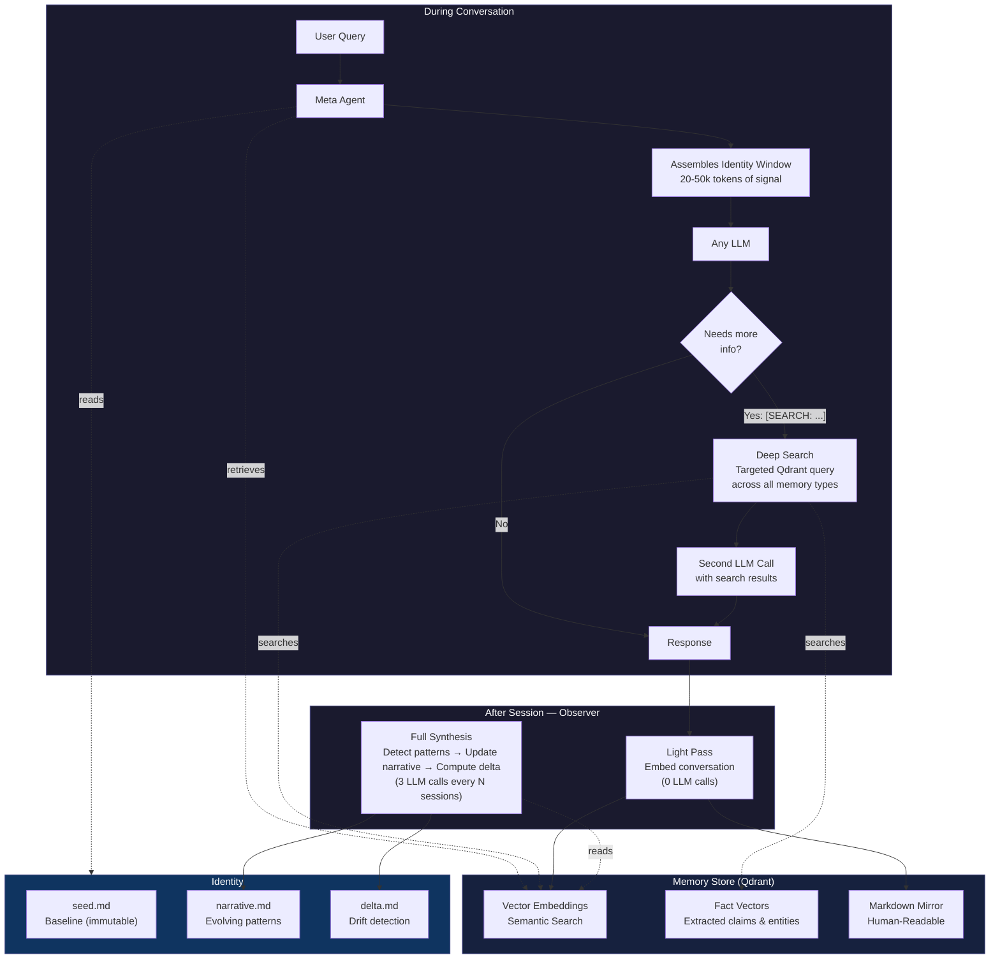

# Cecil v1.1

**Give AI a self.**

Cecil is an open source memory and identity protocol for AI. Not an app — infrastructure. The foundational layer that gives any AI model persistent memory, pattern recognition, and a continuous sense of context over time.

Every AI currently forgets you the moment you close the tab. Not because the models aren't powerful enough — because there's no persistent self underneath them. Cecil fixes that.



---

## What Makes This Different

Most AI memory solutions stuff everything into a context window. That creates noise, not memory. The model gets lost, reasoning degrades, hallucinations increase.

Cecil distributes memory across four layers:

1. **Memory Store** — Qdrant vector database running locally. Every conversation, observation, and data point gets embedded and stored. Retrieval is semantic, not keyword-based. Fast and free — no LLM calls.

2. **Observer** — Runs after sessions. Detects patterns, contradictions, and evolution over time. Compresses raw memory into insight. Light pass every session (zero LLM calls), full synthesis every N sessions (3 LLM calls).

3. **Meta Agent** — Assembles a distilled identity window before every conversation. 20-50k tokens of signal, not noise. The AI doesn't get your entire history — it gets the compressed understanding of who you are and what matters right now.

4. **Deep Search** *(new in v1.1)* — Active retrieval loop. When the AI doesn't know the answer, it can trigger a targeted search across all memory types — facts, podcasts, observations — and respond with sourced information instead of guessing. No function calling required. Works with any LLM via a marker-based system.

The result: an AI that doesn't just remember what you said — it understands how you think, can look things up when it needs to, and evolves.

---

## It Evolves

Cecil isn't static memory. It's a feedback loop.

The observer doesn't just store data — it watches for **drift**. Every few sessions, it compares what was configured (the seed) against what it's actually seeing (the patterns). The delta between those two is where the insight lives.

This works the same way whether Cecil is observing a person, an agent, or itself.

- The **seed** is the initial configuration — what the subject was set up to be.
- The **narrative** is the evolving understanding — what the patterns actually show.
- The **delta** is the drift — where reality diverges from intent.

If Cecil is powering an agent, and that agent starts behaving differently than configured — responding differently, prioritizing different things, drifting from its original purpose — the observer catches it. The narrative updates. The delta surfaces the gap. The agent can then use that self-awareness to correct course or lean into the evolution.

This is what makes it alive in a meaningful sense. It's not just remembering — it's noticing its own patterns, detecting its own drift, and building an evolving model of what it's becoming. The observer doesn't care if it's watching a human or watching itself. It just looks for the gap between baseline and reality.

---

## Deep Search (v1.1)

In v1.0, Cecil could only use what was automatically retrieved into its context window before responding. If the right memory didn't surface, it would guess — or worse, confidently say something wrong.

Deep search fixes this. When Cecil encounters a factual question it can't answer from its current context, it triggers an active search:

1. The LLM outputs a `[SEARCH: keyword query]` marker instead of guessing
2. The bot intercepts the marker and runs a targeted Qdrant search across all memory types (facts, podcasts, observations) with generous limits
3. Search results are injected into a second prompt
4. The LLM responds with sourced, accurate information

This works with **any LLM** — no function calling required. The marker-based system uses standard text output that any model can produce.

Deep search is toggleable at runtime. In the Discord bot, use `!deepsearch` to toggle it on/off. When off, Cecil responds in a single LLM call (~6s). When on, factual questions that trigger a search take two calls (~12s) but return accurate, sourced answers.

---

## Fact Extraction (v1.1)

Raw transcript chunks are great for broad context, but specific facts get diluted in 10-minute blocks. A mention of a family member buried in a long conversation about photography won't match a direct question like "do I have a wife?"

The fact extraction pipeline solves this by creating small, precise, entity-rich vectors:

```bash
# Extract facts from all transcripts
npx tsx scripts/extract-facts.ts
```

This sends each transcript chunk through the LLM with an extraction prompt that pulls out:
- **Personal facts** — family, relationships, age, location
- **Career facts** — jobs, projects, companies, timelines
- **Opinions** — stated positions on topics
- **Experiences** — events, milestones, achievements
- **Preferences** — likes, dislikes, habits

Each fact is stored as a self-contained sentence (e.g., "John has a wife named Jamie and daughters who do Jiu Jitsu together") that embeds well against direct questions. The deep search system queries these fact vectors alongside podcast chunks for high-precision answers.

---

## The Real Power: Ingestion

The onboarding flow asks 5 seed questions to get started. That's the cold start. It works, but it's shallow.

The real power is feeding Cecil raw content and letting the observer synthesize it:

- **Podcasts** — 44 hours of unfiltered conversation transcribed and embedded. Cecil learns how you argue, what you believe, your recurring themes, your contradictions. Richer than any profile page.
- **Blog posts, journal entries, writing** — Feed it your words, it learns your voice.
- **Code repositories** — Feed it your codebase, it learns your architecture, patterns, and failure modes.
- **Chat history** — Feed it Slack, Discord, or support logs. It learns group dynamics, communication patterns, escalation triggers.
- **Research** — Feed it papers, transcripts, documentation. It synthesizes themes across sources.

The protocol is the same every time: **Ingest → Embed → Observe → Synthesize → Retrieve.** What changes is what you feed it and what you ask it to remember.

The included podcast pipeline (`scripts/transcribe-podcasts.py`) is one example. Point it at an RSS feed, it downloads, transcribes with faster-whisper on GPU, chunks the transcripts, embeds them into Qdrant, and runs synthesis. You can build the same pipeline for any content source.

---

## Use Cases

Cecil is not just a "get to know you" tool. The memory + observation + synthesis loop is a general-purpose pattern:

- **Personal AI** — An AI that actually knows you. References things you said months ago. Notices when you contradict yourself. Evolves its understanding as you do.
- **Agent memory** — Give any AI agent persistent context. A Discord bot that remembers every conversation. A coding assistant that learns your codebase over time.
- **Team of agents** — Spin up multiple Cecil instances with different memory pools. Each one observes different data, develops different expertise, maintains its own identity.
- **Moderation** — Feed it channel history. It learns community dynamics, detects pattern shifts, understands context that keyword filters miss.
- **Autonomous workflows** — An agent that runs recursive tasks and learns from each iteration. It doesn't just execute — it observes what worked, what failed, and adapts.

---

## Architecture

```
User query → Meta Agent → assembles identity window from memory
                ↓
         LLM generates response
                ↓
         [SEARCH: ...] marker? ──Yes──→ Deep Search (Qdrant)
                │                           ↓
                No                    Second LLM call with results
                ↓                           ↓
         Send response ←────────────────────┘
                ↓
         After session → Observer embeds new data, detects patterns,
                         updates narrative + delta every N sessions
```

All memory is dual-stored:
- **Vector embeddings** in Qdrant (fast semantic retrieval)
- **Human-readable markdown** in `/memory/` (inspectable, editable, deletable)

Memory types:
- `podcast` — Transcript chunks (~10 min blocks) for broad context
- `fact` — Extracted claims and entities for precision retrieval
- `conversation` — Embedded chat sessions
- `observation` — Synthesized patterns from the observer

Identity lives in three files:
- `identity/seed.md` — Baseline configuration (immutable once set)
- `identity/narrative.md` — Evolving understanding based on observed patterns (updated by observer)
- `identity/delta.md` — Drift between baseline and reality (updated by observer)

---

## Quick Start

### Prerequisites

- Node.js 18+
- Docker (for Qdrant)
- Any OpenAI-compatible LLM (local or cloud)

### Setup

```bash
# Clone
git clone https://github.com/johnkf5-ops/cecil-protocol.git
cd cecil-protocol

# Start Qdrant
docker compose up -d

# Install dependencies
npm install

# Configure your LLM endpoint
cp .env.example .env
# Edit .env — set LLM_BASE_URL and MODEL for your provider

# Run
npm run dev
```

Open `http://localhost:3000` — complete the onboarding, then start chatting.

### Feed It Content (Optional)

The onboarding gives you a seed. To go deeper, feed Cecil real content:

```bash
# Example: Podcast transcription pipeline
pip install faster-whisper requests feedparser

# Edit scripts/transcribe-podcasts.py — set your RSS feed URL
python scripts/transcribe-podcasts.py

# Ingest transcripts into Cecil
curl -X POST http://localhost:3000/api/ingest-podcasts

# Transcribe local interview audio (MP3/M4A/WAV)
# Place audio files in podcasts/interviews/
python scripts/transcribe-interviews.py

# Ingest interview transcripts
npx tsx scripts/ingest-interviews.ts

# Extract structured facts from all transcripts (v1.1)
npx tsx scripts/extract-facts.ts
```

Build your own ingestion pipelines for any content source. The pattern:
1. Get your content into text
2. Chunk it into meaningful segments
3. Use `embedBatch()` from `cecil/embedder.ts` to store in Qdrant
4. Run `scripts/extract-facts.ts` to extract precise, searchable facts
5. Run synthesis via `cecil/podcast-observer.ts` pattern to extract high-level insights

### Customizing Onboarding

The default onboarding asks 5 seed questions. You can customize these in `onboarding/questions.ts` to ask whatever matters for your use case. The seed is just a starting point — the observer will build the real understanding over time from actual interactions and ingested content.

---

## Tech Stack

- **Next.js** — Frontend and API routes
- **TypeScript** — Everything
- **Qdrant** — Vector database, local via Docker
- **FastEmbed** — Local embeddings (all-MiniLM-L6-v2, 384 dims, zero API cost)
- **Any LLM** — OpenAI-compatible endpoint (LM Studio, Ollama, Claude, GPT, etc.)
- **Markdown** — Human-readable memory mirror

---

## Project Structure

```
cecil/
  types.ts              — Shared types (MemoryType, SearchResult, etc.)
  embedder.ts           — FastEmbed + Qdrant writes
  retriever.ts          — Semantic search against Qdrant
  deep-search.ts        — Active retrieval across all memory types (v1.1)
  fact-extractor.ts     — LLM-based fact extraction from transcripts (v1.1)
  observer.ts           — Post-session pattern detection + synthesis
  meta.ts               — Identity window assembly + chat
  llm.ts                — LLM wrapper (any OpenAI-compatible endpoint)
  podcast-ingest.ts     — Podcast transcript ingestion
  podcast-observer.ts   — Podcast-specific synthesis

discord/
  index.ts              — Discord bot entry point (message handler, deep search loop)
  prompt.ts             — System prompt builder (includes deep search prompts)
  history.ts            — Discord message history fetcher
  session.ts            — Session management + observer integration
  config.ts             — Bot configuration

onboarding/
  questions.ts          — Seed questions (customizable)
  seed-builder.ts       — Converts answers → seed.md + embeddings

app/api/
  chat/route.ts         — Chat endpoint
  observe/route.ts      — Observer endpoint
  onboard/route.ts      — Onboarding endpoint
  status/route.ts       — Status check
  ingest-podcasts/route.ts — Podcast ingestion + synthesis

scripts/
  transcribe-podcasts.py    — Download + transcribe podcasts (faster-whisper/CUDA)
  transcribe-interviews.py  — Transcribe local interview audio files (v1.1)
  ingest-interviews.ts      — Ingest interview transcripts into Qdrant (v1.1)
  extract-facts.ts          — Extract structured facts from all transcripts (v1.1)

identity/               — User identity documents (gitignored)
memory/                 — Human-readable memory mirror (gitignored)
```

---

## Design Principles

1. **Local first.** Qdrant runs locally. No cloud dependency for memory.
2. **Bring your own model.** Any OpenAI-compatible LLM works. Local or cloud.
3. **Markdown mirror.** Every memory has a human-readable version. Inspect, edit, delete.
4. **Observer is post-session.** No LLM calls during conversation. Memory ops happen after.
5. **Compression over accumulation.** The identity window is 20-50k tokens of signal, not your entire history.
6. **The protocol is the product.** Cecil is infrastructure, not an app. Plug it into anything.

---

## Disclaimer

Cecil is provided as-is with no warranty of any kind. This is experimental, open source infrastructure — not a hosted product. You are solely responsible for how you use it, what data you feed it, and what you do with the output. The authors and contributors are not liable for any damages, data loss, or unintended behavior arising from the use of this software. Use at your own risk.

---

## License

Apache 2.0 — see [LICENSE](LICENSE) for full text.

Copyright 2026 Crash Override LLC
