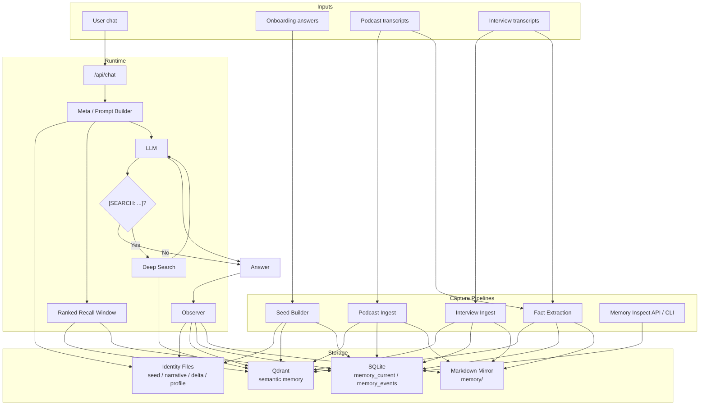

# Cecil v1.2

Persistent memory and identity protocol for AI systems.

Cecil is an open-source protocol for giving AI systems durable identity, inspectable memory, and evidence-aware recall.

Cecil is the working build of what started as Echo Protocol. It gives a bot a durable memory substrate, an evolving identity, and a retrieval loop that can answer from memory instead of guessing.

Cecil has been open source since day one. v1.2 is not a first public release. It is the next public revision of the protocol, focused on making memory more structured, more inspectable, and more honest about what the system actually knows.

This repo tracks the working public Cecil build:

- web chat UI with onboarding
- persistent identity files
- Qdrant semantic memory
- SQLite structured memory substrate
- observer pipeline for post-session synthesis
- deep search for factual recall
- Discord bot integration

## What Makes Cecil Different

Most memory systems stop at chat history plus embeddings.

Cecil is trying to build something stricter than that:

- identity files, not just rolling chat context
- structured memory plus semantic retrieval, not one opaque store
- evidence-aware answers that distinguish direct memory from inference

If you want a persistent AI system that can show what it knows, where it came from, and how certain it should be, that is the direction of this repo.

## What Changed In v1.2

v1.2 is the protocol revision where Cecil stops treating memory as one undifferentiated embedding pile.

The main differences in this version are:

- dual-store memory that keeps Qdrant for semantic retrieval and SQLite for structured current state and lifecycle history
- evidence-aware recall tiers that distinguish `SEED_STATED`, `PUBLIC_CORPUS_FACT`, `PUBLIC_CORPUS_INFERENCE`, and `PRIVATE_CONVERSATION`
- synthesized seed-profile, identity, and relationship observations that answer broad questions more cleanly than raw transcript facts alone
- ranked recall improvements that reduce recency pollution, collapse duplicate fact/milestone twins, and better prioritize topical matches
- retirement of stale synthesized memories so outdated facets do not linger in current state

This version is less about adding UI surface area and more about making the protocol's memory claims legible, inspectable, and epistemically disciplined.

## Who This Is For

Cecil is for people building systems that need continuity, not just chat completion.

That includes:

- personal AI systems that should actually remember a person over time
- agent builders who want memory, identity, and drift detection
- researchers experimenting with long-lived AI behavior
- bot builders who want inspectable memory instead of opaque prompting
- developers building multi-agent environments where relationships should persist

If what you want is "one more chat wrapper," Cecil is probably too much.

If what you want is a memory protocol that can grow into a real substrate for persistent AI, this is what the repo is for.

## Architecture Diagram



## What Cecil Does

Cecil does not just keep chat history.

It maintains several layers of memory:

- `seed` for the original baseline identity
- `narrative` for the evolving self-model
- `delta` for drift between baseline and observed behavior
- `conversation` memory from sessions
- `observation` memory from synthesis passes, including profile, identity, and relationship layers
- `fact` memory extracted from long-form content
- `podcast` and interview transcript memory
- `milestone` memory derived from meaningful experiences/events

It stores memory in two forms at the same time:

- Qdrant for semantic retrieval
- SQLite for structured current state and append-only memory events

That combination is the current build's main upgrade. Qdrant is still used. SQLite was added underneath it so memory has a better substrate for ranking, provenance, debugging, and future recall logic.

## Current Architecture

### 1. Identity Layer

Identity lives in:

- `identity/seed.md`
- `identity/narrative.md`
- `identity/delta.md`
- optionally `identity/profile.md`

The seed is immutable. Narrative and delta change over time as Cecil observes actual behavior.

### 2. Capture Layer

Cecil currently writes structured memory for:

- onboarding seed capture
- seed-derived profile observations
- conversation/session capture
- observer synthesis results
- podcast ingestion
- interview ingestion
- transcript fact extraction
- milestone derivation from experience facts
- synthesized public-corpus identity observations
- synthesized public-corpus relationship observations

### 3. Storage Layer

Human-readable memory stays in `memory/`.

Structured memory now also lives in:

- `memory/structured-memory.sqlite`

That SQLite database contains:

- `memory_current`
- `memory_events`

`memory_current` is the latest version of a memory record.

`memory_events` is the append-only lifecycle log.

Each record can carry:

- memory type
- timestamp
- session ID
- source path
- source type
- source ID
- source episode
- quality score
- provenance blob

### 4. Retrieval Layer

Retrieval now has two paths:

- Qdrant semantic search
- SQLite ranked recall candidates

The prompt builder merges those signals into a recall window, dedupes them, ranks them, and applies token budgets before handing context to the model.

That recall window now also carries evidence tiers, so Cecil can distinguish hard seed facts from public-corpus facts, public-corpus inference, and private conversation memory.

### 5. Response Layer

Chat works like this:

1. Cecil assembles the identity window
2. Cecil merges recall from structured memory and semantic search
3. The model responds
4. If the model emits `[SEARCH: ...]`, Cecil runs deep search
5. Cecil answers again using the search results
6. After the session, observer capture runs

## Main Features In This Build

### Shared Response Pipeline

Web chat and the newer response flow use the same deep-search pipeline instead of separate logic branches.

### Structured Memory Substrate

SQLite is now part of the protocol, not a replacement for Qdrant.

This is the important current direction of the project.

## Why SQLite Was Added Without Removing Qdrant

This is the key design decision in v1.2.

Qdrant is still valuable because it is good at semantic retrieval across large bodies of text. That is still the right tool for:

- broad semantic recall
- transcript chunk retrieval
- fuzzy matching across long-form content
- fast embedding-based search

But Qdrant alone is not a great full memory substrate.

It does not naturally give you the clean structured behaviors you want for:

- current state vs history
- append-only memory events
- provenance tracking
- source-quality tracking
- exact inspection/debugging
- future ranking logic that needs more than vector similarity

So Cecil now uses both:

- Qdrant for semantic search
- SQLite for structured memory state and lifecycle history

That means the system does not have to choose between:

- fuzzy semantic recall
- precise inspectable memory records

It gets both.

In plain terms:

- Qdrant helps Cecil remember things that are similar
- SQLite helps Cecil know what it knows, where it came from, and what changed

### Evidence-Aware Recall

Cecil now labels memory by what kind of evidence it represents.

Recall and prompt assembly distinguish:

- `SEED_STATED`
- `PUBLIC_CORPUS_FACT`
- `PUBLIC_CORPUS_INFERENCE`
- `PRIVATE_CONVERSATION`

That lets the system answer more honestly. It can prefer direct seed facts when they exist, use public-corpus inference carefully, and say "I do not actually know" when the evidence is not there.

### Identity And Relationship Synthesis

Broad questions are no longer forced to rely only on raw transcript facts.

v1.2 writes:

- seed-derived profile observations
- public-corpus identity observations
- public-corpus relationship observations

This makes questions like "What matters to me?" or "What is my relationship with X?" much cleaner than pure chunk retrieval.

### Ranked Recall Improvements

Ranked recall in v1.2 is no longer just groundwork.

It now reduces unrelated recent-memory pollution, collapses duplicate fact/milestone twins, and gives broad identity questions a cleaner path through synthesized observations.

### Synthesized Memory Retirement

When synthesis reruns, missing facets can now be retired from current memory instead of lingering forever.

That keeps current state cleaner and makes repeated synthesis safer.

### Memory Inspection

You can inspect memory state through:

- CLI: `npm run memory:inspect`
- API: `GET /api/memory`

You can also ask for the merged recall window used for prompting:

- `GET /api/memory?query=your+query&includeWindow=true`

## First 10 Minutes

If you just want to get oriented and see Cecil working, do this:

### Minute 1: start the dependencies

```bash
docker compose up -d
npm run dev
```

Then open `http://localhost:3000`.

### Minute 2: complete onboarding

Answer the onboarding questions so Cecil can create:

- `identity/seed.md`
- `identity/narrative.md`
- `identity/delta.md`

This gives the system a baseline self to work from.

### Minute 3: send a few chat messages

Talk to Cecil for a few turns in the web UI.

That creates:

- markdown session logs in `memory/conversations/`
- Qdrant conversation embeddings
- SQLite structured conversation records

### Minute 4: trigger observer memory

As more sessions happen, the observer writes:

- new observations
- narrative updates
- delta updates

This is where Cecil stops being just a chatbot log and starts becoming a memory system.

### Minute 5: inspect the structured memory

Use the API:

```text
GET /api/memory
```

Or use the CLI:

```bash
npm run memory:inspect -- --limit=10
```

You should see current memory state and recent memory events.

### Minute 6: inspect the actual recall window

Ask the memory API for a ranked recall window:

```text
GET /api/memory?query=what+matters+to+me&includeWindow=true
```

This shows the merged memory context Cecil is preparing before answering.

### Minute 7: test deep search

Ask Cecil a factual question that may require retrieval from stored memory.

If the first prompt does not have enough context, Cecil can emit `[SEARCH: ...]`, run deep search, and answer from the retrieved results.

### Minute 8: ingest longer content

If you have transcripts or audio:

```bash
python scripts/transcribe-podcasts.py
curl -X POST http://localhost:3000/api/ingest-podcasts
```

Or for interviews:

```bash
python scripts/transcribe-interviews.py
npx tsx scripts/ingest-interviews.ts
```

### Minute 9: extract facts

```bash
npx tsx scripts/extract-facts.ts
```

This creates smaller, sharper factual memory records and milestone records.

### Minute 10: inspect again

Run the memory inspector one more time:

```bash
npm run memory:inspect -- --query="What matters to me?" --window
```

At that point you can see the difference between:

- raw stored memory
- structured current state
- append-only memory events
- the final ranked recall window

That is the fastest path to understanding the system end to end.

## How Memory Flows Through The System

This section is for non-technical readers.

Think of Cecil like a person who has:

- a baseline identity
- a notebook
- a filing cabinet
- a pattern detector
- a way to look things up before answering

Here is the flow in plain English:

### 1. Cecil starts with a seed

When you onboard, you give Cecil a starting point.

That seed is the original statement of identity. It is the "this is who I am supposed to be" layer.

### 2. Conversations are captured after they happen

When you chat with Cecil, the system does not try to rewrite its whole identity in the middle of every message.

Instead, after the conversation:

- the session is logged
- memory records are written
- embeddings are stored for later retrieval

This keeps the live conversation fast and keeps memory capture clean.

### 3. The observer looks for patterns

After enough sessions, Cecil runs an observer pass.

The observer asks questions like:

- what themes keep repeating?
- what changed?
- what does behavior show that the seed did not?
- where is there drift?

That observer updates the evolving self-model.

### 4. Long-form content adds depth

Podcasts and interviews give Cecil more than just short chats.

They give:

- tone
- recurring ideas
- story arcs
- factual details
- examples of how someone actually thinks over time

This makes the memory system much richer than onboarding alone.

### 5. Facts are extracted into sharper memory

Long transcript chunks are useful, but sometimes too broad.

So Cecil also extracts smaller fact records such as:

- relationships
- places
- work history
- opinions
- experiences
- milestones

That makes factual recall much more accurate.

### 6. Memory is stored two ways

Qdrant helps Cecil find semantically similar things.

SQLite helps Cecil keep a structured memory state with provenance and history.

The markdown files make everything inspectable by a human.

So memory is not trapped inside one opaque system.

### 7. Before answering, Cecil builds a memory window

When you ask a question, Cecil does not dump all memory into the prompt.

It tries to assemble:

- the core identity files
- the most relevant structured memory
- the most relevant semantic hits
- the most useful observations

Then it compresses that into a ranked recall window.

### 8. If needed, Cecil searches again

If Cecil still does not have enough evidence to answer safely, it can explicitly trigger deep search.

That means:

- first pass: answer if enough context is already present
- second pass: retrieve more evidence if needed

This is how Cecil avoids pretending to remember things it does not actually have.

### 9. The system gets better over time

The important thing is that memory is not static.

Cecil keeps accumulating:

- conversations
- observations
- transcript knowledge
- extracted facts
- milestones
- drift signals

That is what makes it a protocol for persistent identity, not just a chat app with a history tab.

## Quick Start

### Requirements

- Node.js 24 recommended
- Docker for Qdrant
- an OpenAI-compatible model endpoint

### Install

```bash
npm install
docker compose up -d
```

### Configure

Create `.env` from `.env.example` and set your model endpoint values.

At minimum, configure the LLM values used by `cecil/llm.ts`.

### Run the Web App

```bash
npm run dev
```

Then open:

```text
http://localhost:3000
```

Complete onboarding first so Cecil has a seed identity.

## What Working Looks Like

When Cecil is working properly, you should be able to observe all of these:

- onboarding creates `identity/seed.md`, `identity/narrative.md`, and `identity/delta.md`
- chatting creates new files under `memory/conversations/`
- `GET /api/memory` returns non-empty `current` and usually `events`
- `GET /api/memory?query=...&includeWindow=true` returns a `recallWindow`
- factual questions produce better answers after more chats, observations, and transcript ingest

If those things are not happening, the system is not really "remembering" yet, even if the UI still responds.

## Useful Commands

```bash
npm run dev
npm run lint
npm run discord
npm run memory:inspect
npm run memory:audit
npm run memory:synthesize
```

## Memory Audit

`npm run memory:audit` is the fastest way to check whether Cecil's memory layer is healthy.

It reports:

- total current records and event records
- which memory types are actually present
- which source pipelines are writing
- stale memory types
- low-quality records
- duplicate current memories
- optional ranked recall preview for a query

This is the best command to run when Cecil feels blank, generic, or inconsistent and you want to know whether the problem is memory capture or answer generation.

## Real Inspection Examples

These are abbreviated examples of the actual shapes returned by the current build.

### `GET /api/memory`

```json
{
  "current": [
    {
      "memoryKey": "conversation:session-123:user-priorities",
      "memoryType": "conversation",
      "text": "<username> is focused on building Cecil into a persistent AI protocol.",
      "sourceType": "conversation_session",
      "qualityScore": 0.74,
      "createdAt": "2026-03-06T20:11:00.000Z",
      "updatedAt": "2026-03-06T20:11:00.000Z",
      "provenance": {
        "sessionId": "session-123"
      }
    }
  ],
  "events": [
    {
      "eventId": "obs-session-123-1",
      "action": "capture",
      "memoryKey": "observation:session-123:recurring-theme",
      "memoryType": "observation",
      "text": "Cecil observed a recurring theme around durable memory and identity.",
      "sourceType": "observer_synthesis",
      "qualityScore": 0.82,
      "createdAt": "2026-03-06T20:13:00.000Z",
      "updatedAt": "2026-03-06T20:13:00.000Z",
      "provenance": {
        "sessionId": "session-123"
      }
    }
  ],
  "ranked": [],
  "recallWindow": null
}
```

### `GET /api/memory?query=what+matters+to+me&includeWindow=true`

```json
{
  "current": [],
  "events": [],
  "ranked": [
    {
      "memoryKey": "observation:podcast-identity:values",
      "memoryType": "observation",
      "text": "Public-corpus inference: In the public podcast corpus, <username> appears to value building things that feel original, useful, and ahead of the curve.",
      "sourceType": "observer_synthesis",
      "qualityScore": 0.93,
      "recallScore": 5.2,
      "lexicalHits": 2,
      "createdAt": "2026-03-09T03:15:00.000Z",
      "updatedAt": "2026-03-09T03:15:00.000Z",
      "provenance": {
        "observationKind": "identity",
        "knowledgeScope": "public_corpus",
        "epistemicStatus": "public_corpus_inference",
        "confidenceBand": "high"
      }
    }
  ],
  "recallWindow": {
    "formattedContext": "=== EVIDENCE GUIDE ===\nSEED_STATED = directly provided in onboarding/seed memory.\nPUBLIC_CORPUS_FACT = directly supported by stored public-corpus facts.\nPUBLIC_CORPUS_INFERENCE = synthesis from public material; useful, but not private certainty.\nPRIVATE_CONVERSATION = learned from direct private interaction.\nIf no tier gives solid support, answer that it is not known.\n\n=== OBSERVATIONS ===\n- [PUBLIC_CORPUS_INFERENCE | high_confidence | observation | podcast-identity | 2026-03-09T03:15:00.000Z] Public-corpus inference: In the public podcast corpus, <username> appears to value building things that feel original, useful, and ahead of the curve.",
    "snippets": [
      {
        "memoryType": "observation",
        "excerpt": "Public-corpus inference: In the public podcast corpus, <username> appears to value building things that feel original, useful, and ahead of the curve.",
        "sourceLabel": "PUBLIC_CORPUS_INFERENCE | high_confidence | observation | podcast-identity | 2026-03-09T03:15:00.000Z",
        "score": 5.2,
        "source": "structured_candidate"
      }
    ]
  }
}
```

### `POST /api/chat`

Request:

```json
{
  "messages": [
    { "role": "user", "content": "What do you remember about what matters to me?" }
  ]
}
```

Response shape:

```json
{
  "message": "You have been focused on building Cecil into a real persistent memory protocol...",
  "usedDeepSearch": false
}
```

The exact response text will vary by model, but the important part is that the answer should start reflecting stored memory instead of only the current turn.

## Troubleshooting

### `/api/memory` is empty

Usually this means one of these:

- onboarding has not been completed yet
- you have not had enough chats to generate memory writes
- the observer has not run yet
- you are looking in the wrong repo or wrong runtime directory

### `current` has data but answers still feel generic

That usually means:

- the stored memories are too weak or too vague
- the query does not match memory well enough yet
- Qdrant is down, so semantic recall is weaker
- the ranked recall window is returning too little useful context

Check:

- `GET /api/memory?query=your+question&includeWindow=true`

If the recall window looks weak, the answer will usually look weak too.

### `recallWindow` is `null`

That is expected unless you pass both:

- `query=...`
- `includeWindow=true`

### Deep search never seems to happen

That can mean:

- the first-pass prompt already had enough context
- the model is not emitting `[SEARCH: ...]`
- retrieval data is too thin to justify a second pass

### Qdrant problems

If Qdrant is not running, Cecil may still work partially, but recall quality will drop.

Check:

```bash
docker compose up -d
```

Then verify the app and memory inspection routes again.

### Memory Inspection Examples

```bash
npm run memory:inspect -- --limit=10
npm run memory:inspect -- --types=fact,observation --limit=20
npm run memory:inspect -- --query="What matters to me?" --window
npm run memory:audit -- --limit=200
npm run memory:audit -- --query="What matters to me?"
```

### API Inspection Examples

```text
GET /api/memory
GET /api/memory?types=fact,observation
GET /api/memory?query=ranked+recall&includeWindow=true
GET /api/memory?includeAudit=true
GET /api/memory?query=what+matters+to+me&includeAudit=true
```

## Ingesting Long-Form Content

### Podcasts

Transcribe:

```bash
python scripts/transcribe-podcasts.py
```

Then ingest:

```bash
curl -X POST http://localhost:3000/api/ingest-podcasts
```

### Interviews

Put audio files in `podcasts/interviews/`, then:

```bash
python scripts/transcribe-interviews.py
npx tsx scripts/ingest-interviews.ts
```

### Fact Extraction

To extract smaller, more precise memory records from transcripts:

```bash
npx tsx scripts/extract-facts.ts
```

This writes:

- fact vectors to Qdrant
- fact logs to `memory/facts/`
- structured fact records to SQLite
- milestone records for meaningful experience/event facts

To regenerate synthesized profile, identity, and relationship observations from the stored corpus:

```bash
npm run memory:synthesize
```

## Core API Routes

- `POST /api/chat` - main chat endpoint
- `POST /api/onboard` - create the seed identity
- `POST /api/observe` - force observer processing for a session
- `POST /api/ingest-podcasts` - ingest podcasts and synthesize
- `GET /api/status` - onboarding state
- `GET /api/memory` - inspect structured memory and recall window

## Project Structure

```text
app/
  api/
    chat/
    ingest-podcasts/
    memory/
    observe/
    onboard/
    status/

cecil/
  deep-search.ts
  embedder.ts
  fact-extractor.ts
  llm.ts
  memory-store.ts
  meta.ts
  observer.ts
  podcast-ingest.ts
  podcast-observer.ts
  ranked-recall.ts
  recall-window.ts
  response-pipeline.ts
  retriever.ts
  types.ts

discord/
  index.ts
  prompt.ts
  session.ts

onboarding/
  questions.ts
  seed-builder.ts

scripts/
  extract-facts.ts
  ingest-interviews.ts
  inspect-memory.ts
  transcribe-interviews.py
  transcribe-podcasts.py
```

## Design Direction

This repo is not trying to be "chat history with embeddings."

The direction is:

- identity first
- memory quality over memory volume
- observer-driven synthesis
- provenance-aware storage
- ranked recall before prompt injection
- local inspectability

The point of Cecil is not just remembering text.

The point is giving a model a durable self, a memory substrate you can inspect, and a retrieval loop that improves over time.

## Roadmap

### v1.2

This version establishes the current public Cecil foundation:

- shared response pipeline
- dual-store memory with Qdrant and SQLite
- ranked recall with structured candidate scoring and dedupe
- evidence-aware recall tiers
- seed-profile observations
- synthesized public-corpus identity and relationship observations
- retireable synthesized memory
- inspectable memory state through API and CLI

### v1.3

The next version should focus on broadening what kinds of knowledge Cecil can hold, not just tuning the same public-corpus path harder.

That likely means:

- a private reflection layer separate from public-corpus inference
- stronger contradiction and drift checks across seed, public, and private memory
- a broader evaluation suite for real recall behavior
- better memory browsing and debugging tools
- more explicit low-confidence handling in synthesis and answer generation

### After That

Once the recall layer is stronger, the protocol can push further into:

- better observer quality
- richer contradiction and drift detection
- stronger memory tooling
- multi-agent memory ecosystems built on top of the same protocol

## Current Status

This build now includes:

- Qdrant plus SQLite dual-store memory
- evidence-tiered recall
- seed-profile observations
- public-corpus identity and relationship synthesis
- structured fact, milestone, and observation capture
- merged recall window with dedupe and cleaner ranking
- retireable synthesized memories
- memory inspection API and CLI
- Discord bot integration

The next layer after this is expanding beyond public-corpus inference into private reflection and stronger longitudinal evaluation.

## License

Apache 2.0. See [LICENSE](LICENSE).
