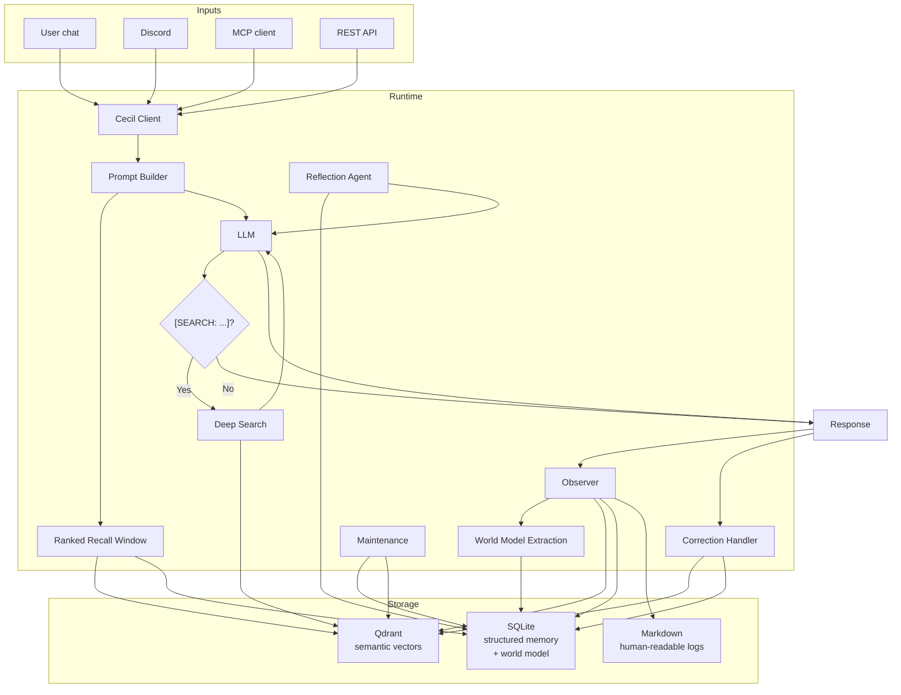

# Architecture

## Overview

Cecil is a Next.js application with four core systems — **Storage** (Qdrant + SQLite), **Observe** (extraction + synthesis), **Recall** (ranked retrieval with domain matching and evidence tiers), and **Maintain** (dedup, quality, refresh) — plus multiple integration surfaces (web UI, Discord, REST API, MCP).

```
User input → Chat → Recall (ranked context) → LLM → Response
                                                 ↓
                                    Observer → World Model extraction
                                                 ↓
                                    Storage (Qdrant + SQLite + Markdown)
                                                 ↓
                                    Maintenance (dedup, quality, refresh)
```

## Data Flow



## Storage Layers

### Qdrant (Vector Store)

Semantic search across all memory types. Used for:
- Broad "find similar" queries
- Deep search when the LLM needs more context
- Fuzzy matching across long-form content

### SQLite (Structured Memory)

Two core tables plus the world model:

**Memory tables:**
- `memory_current` — Latest version of each memory record (upsertable)
- `memory_events` — Append-only lifecycle log of all writes

**World model tables:**
- `world_entities` — People, projects, orgs, places, topics
- `world_entity_mentions` — Links entities to memory keys
- `world_beliefs` — Opinions, values, preferences (active/revised/contradicted) with temporal validity windows (`valid_from`/`valid_to`)
- `world_open_loops` — Unresolved TODOs and follow-ups (open/resolved/stale)
- `world_contradictions` — Conflicting statements with source references

### Markdown (Human-Readable)

Conversations and observations are mirrored to `memory/` as markdown files for direct inspection:
- `memory/conversations/` — Session logs
- `memory/observations/` — Synthesis results
- `identity/narrative.md` — Evolving understanding
- `identity/delta.md` — Drift from baseline

## Core Modules

| Module | Purpose |
|---|---|
| `cecil/client.ts` | Universal integration API |
| `cecil/meta.ts` | Prompt assembly + identity window |
| `cecil/observer.ts` | Light pass (every session) + full synthesis (every N sessions) |
| `cecil/world-model.ts` | Entity/belief/loop/contradiction tracking |
| `cecil/recall-window.ts` | Ranked recall with evidence tiers and token budgets |
| `cecil/memory-store.ts` | SQLite structured memory |
| `cecil/embedder.ts` | Qdrant vector operations |
| `cecil/retriever.ts` | Semantic search |
| `cecil/domain.ts` | Heuristic domain detection for memory tagging |
| `cecil/ranked-recall.ts` | TF-IDF weighted lexical + quality scoring |
| `cecil/reflection.ts` | LLM-synthesized analysis of world model |
| `cecil/maintenance.ts` | Dedup, quality sweep, stale detection, refreshes |
| `cecil/response-pipeline.ts` | Chat → deep search → response flow |
| `cecil/correction-handler.ts` | Detects and embeds user corrections |
| `cecil/deep-search.ts` | Cross-type memory search |
| `cecil/llm.ts` | OpenAI-compatible chat completion wrapper |
| `cecil/web-search.ts` | Web search via Brave API |
| `cecil/mcp-server.ts` | MCP tool server (stdio) |

## Observer Pipeline

Two phases:

### Light Pass (every session, 1 LLM call)
1. Write conversation to markdown log
2. Detect domain from conversation content (heuristic, no LLM)
3. Embed full conversation, individual user messages, and Q+A exchange pairs to Qdrant (all tagged with domain)
4. Record to `memory_current` as conversation type
5. Extract world model data (entities, beliefs, open loops, contradictions) via 1 LLM call

### Full Synthesis (every N sessions, 3 additional LLM calls)
1. Detect patterns from recent conversations + observations
2. Update `identity/narrative.md` with evolved understanding
3. Update `identity/delta.md` with drift from baseline
4. Write observation to memory

## Recall Pipeline

When Cecil responds to a message:

1. Tokenize the query, filter stopwords
2. Detect query domain (heuristic)
3. Run TF-IDF weighted lexical search on SQLite `memory_current` with domain boost (+0.5 for domain match) and exchange-pair boost (+0.3 for questions)
4. Run semantic search on Qdrant for observations, facts, podcasts
5. Merge all results, deduplicate by normalized text, apply domain boost (+0.3) in recall window scoring
6. Apply per-type token budgets (conversations: 180, observations: 220, facts: 280, etc.)
7. Inject world model context (contradictions, beliefs, open loops if relevant)
8. Format with evidence tiers (DIRECT_STATEMENT, OBSERVED_PATTERN, PUBLIC_CORPUS, INFERRED)

## Evidence Tiers

All recalled memories are tagged with an evidence tier:

| Tier | Meaning |
|---|---|
| DIRECT_STATEMENT | User told you directly (onboarding, conversation, correction) |
| OBSERVED_PATTERN | Detected from repeated behavior across conversations |
| PUBLIC_CORPUS | Extracted from public material (podcasts, transcripts) |
| INFERRED | Synthesized from multiple signals — flagged as inference |

This prevents Cecil from treating inference as certainty.
